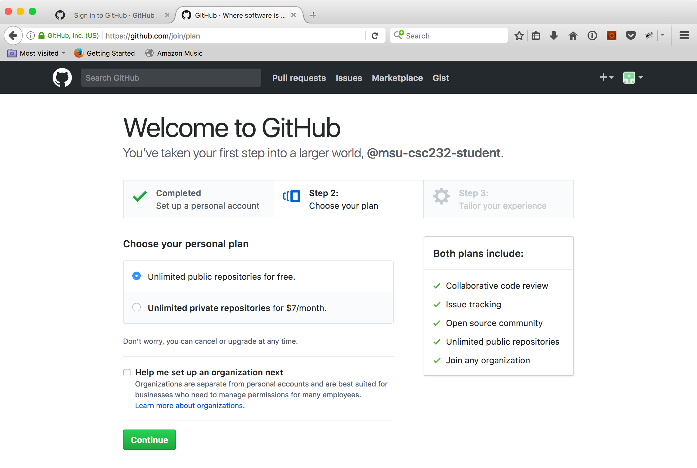
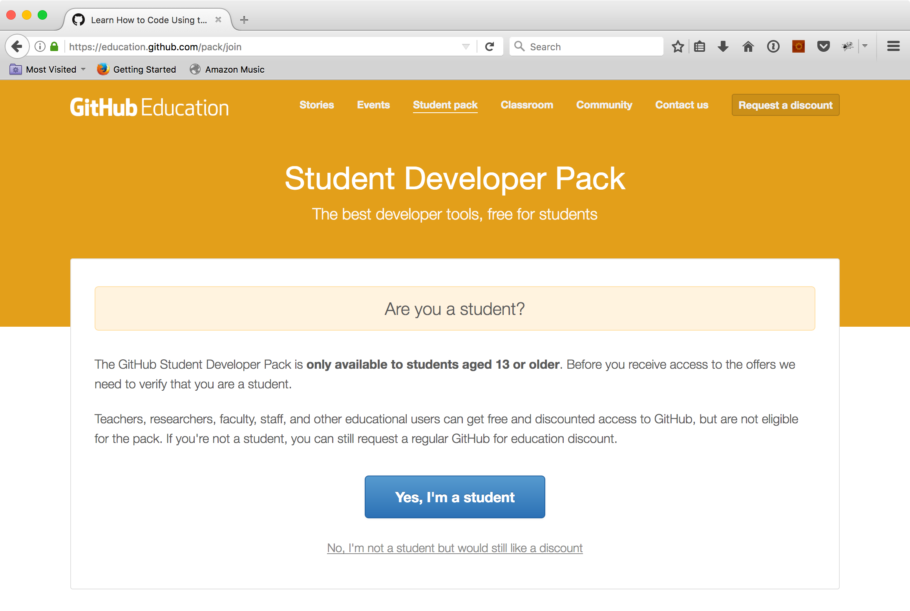
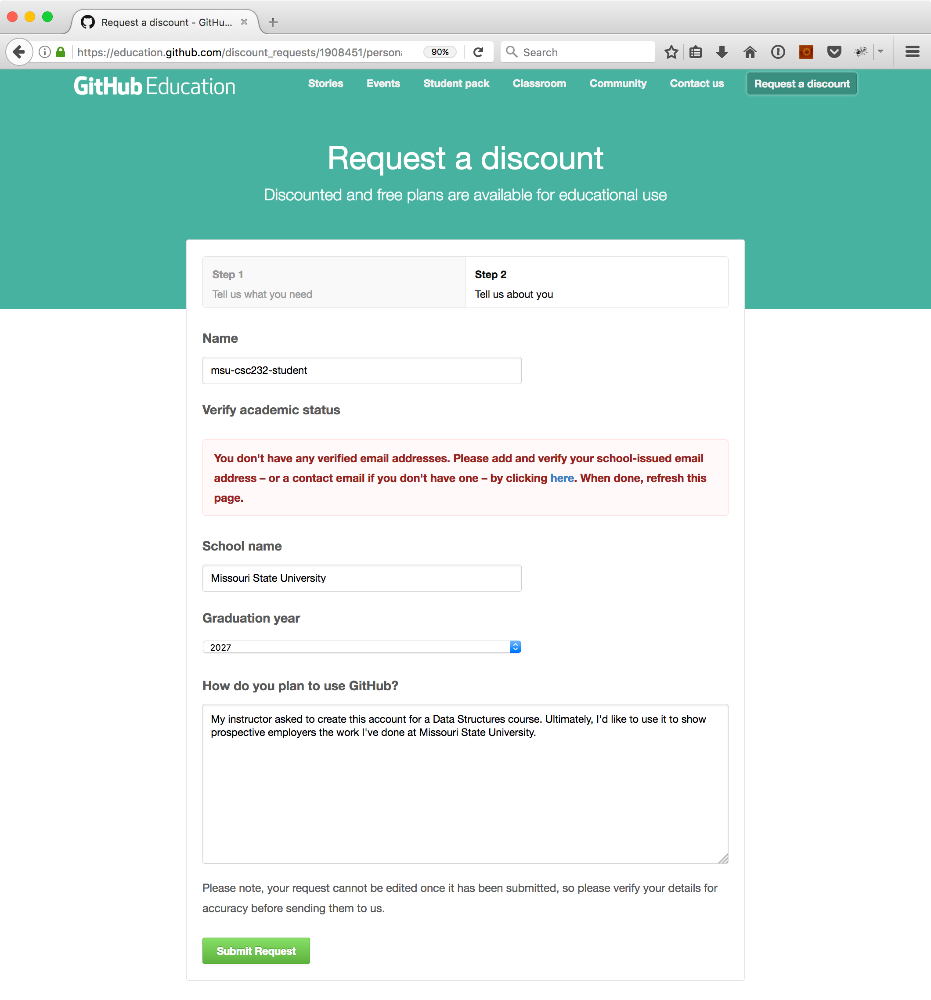
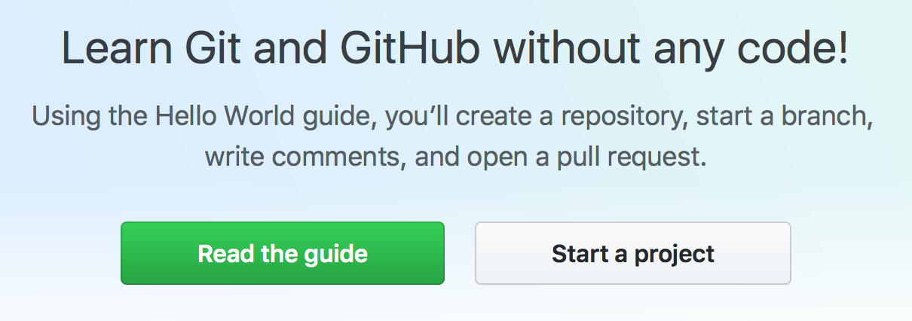
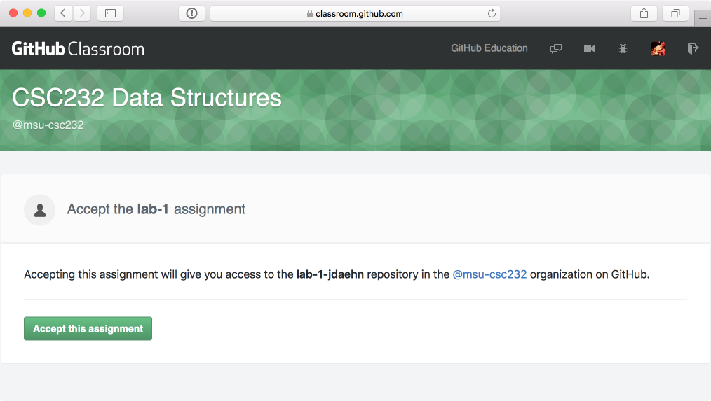
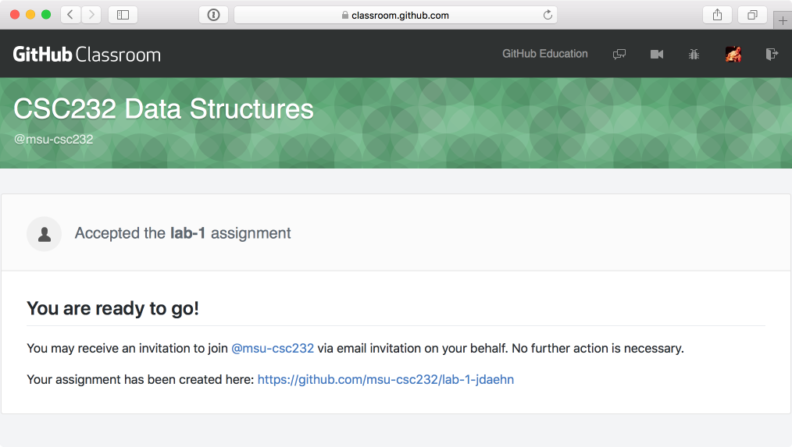
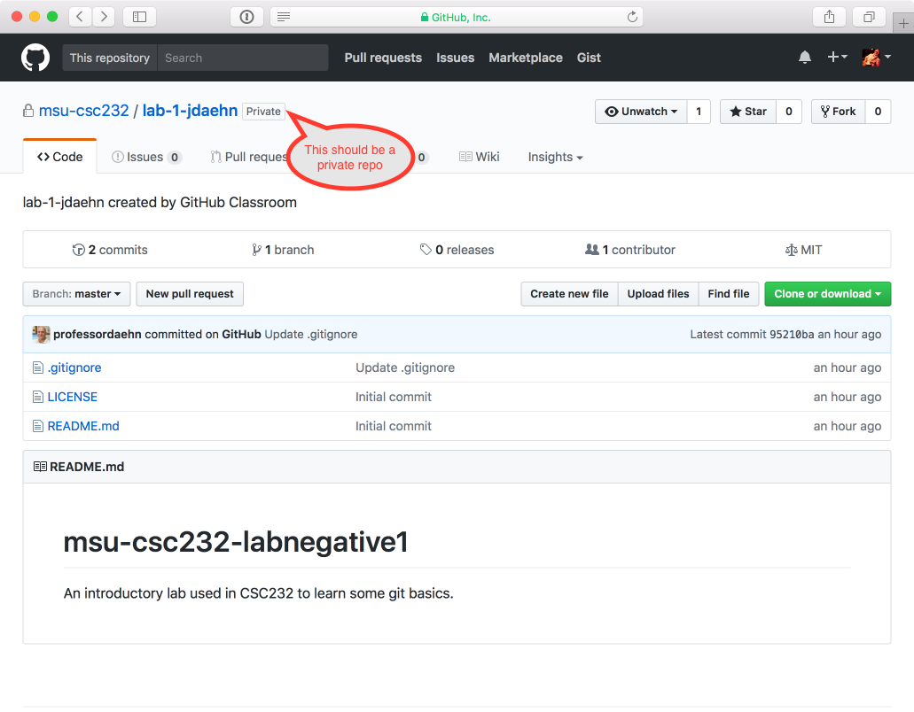

## Lab -1: Introduction to `git`

_Check out the published version of this README here: [https://professordaehn.github.io/msu-csc232-labnegative1](https://professordaehn.github.io/msu-csc232-labnegative1/)..._

### Overview
We begin labs this week by learning the basics of a version control system known as git. Additionally, we shall learn the basics of GitHub, a host that will act as our “central repository” for all our work. As such, fundamentally we would like to accomplish the following this week:

1.	Create a GitHub account
1.	Learn how to accept assignments from our GitHub classroom
1.	Learn how to switch branches (on GitHub)
1.	Learn how to create and edit a file (on GitHub)
1.	Learn how create a pull request

### Introduction: Creating a GitHub Account

Let us begin by visiting [https://github.com](https://github.com) and sign up for a GitHub account (if you don’t already have one; if you do, sign in). If you don’t already have one, for the purposes of this class, it is recommended that you pick a username that matches your BearPass username.


When you sign up, you may be presented with the following screen:



We want an option to have unlimited private repositories … for free. So visit [https://education.github.com/pack/join](https://education.github.com/pack/join)




Request a discount ...



Don't forget to check your e-mail after you submit your request to verify your academic status! Once you have your GitHub account created and verified, send your GitHub username to your instructor using Skype for Business.

### Tutorial on `git`

After you’ve signed into GitHub with your new credentials, you’ll likely see the following at the top of [https://github.com](https://github.com):



If not, the just visit [https://guides.github.com/activities/hello-world/](https://guides.github.com/activities/hello-world/) and run through this tutorial (~10 minutes).

#### Additional Videos on `git`

* [https://guides.github.com/](https://guides.github.com/) (In particular, it is recommended that you view the “Understanding the GitHub Flow,” “Mastering Markdown,” and “Documenting your projects on GitHub” videos.)
* [https://education.github.com/pack](https://education.github.com/pack)
* [https://guides.github.com/introduction/flow/](https://guides.github.com/introduction/flow/)

### GitHub classroom

In the following screen snapshots, please keep in mind that where ever you see "jdaehn" you'll see your GitHub username instead.

Step 1: Log into GitHub

Step 2: Go to [https://classroom.github.com/assignment-invitations/630fc221ed98fb5751c4ee1dd782ac12](https://classroom.github.com/assignment-invitations/630fc221ed98fb5751c4ee1dd782ac12) and click on the "Accept this assignment" button.

 

Step 3: Once the assignment has been created you'll be greeted with a confirmation screen that looks something like:

 

Step 4:	Once you've navigated to the assignment, please verify that it has created a private repo as indicated by the following screen snapshot:

 

Step 5: Next you’ll want to switch to the develop branch. Do this by clicking on the drop-down button with the "Branch: **master**" label and selecting develop.

Step 6: Once you’ve switched branches, create a new file (by clicking on the button that says "Create new file") named bio.txt and provide a brief bio; tell me about yourself, what you like to do, why you’re studying computer science, etc.

Step 7: Save (commit) this file. Use a prefix for the commit message that has the following format:

```
CSC232-LAB-1 - Some meaningful commit message.
```

Step 8: Next create a pull request. At this point, just _create_ the pull request. Your instructor will go ahead and start a review process (just so you see what this is like) and when your instructor finally _approves_ your pull request, go ahead and merge the develop branch into the master branch.

### Recap

Congratulations! You have completed your "negative first" lab. Note what you've learned to do today:

* Creating a GitHub account
* Switching branches (online) in a GitHub repository
* Adding a new file (online) to a GitHub repository in a particular branch
* Creating a pull request that seeks to merge changes found in your develop branch into the master branch of your repository
