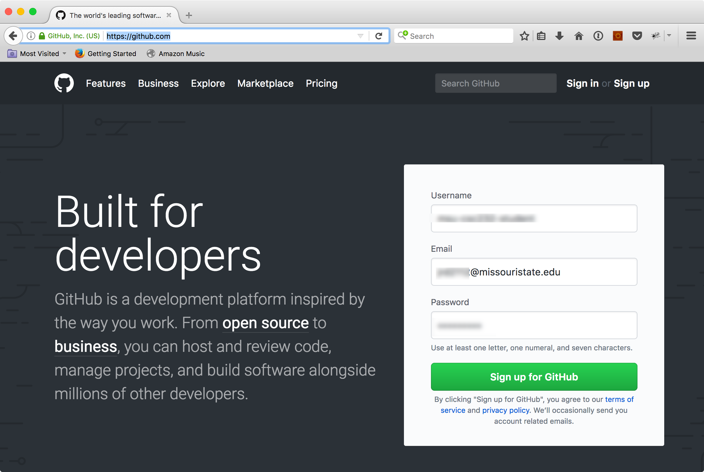

## Lab -1: Introduction to `git`

### Overview
We begin labs this week by learning the basics of a version control system known as git. Additionally, we shall learn the basics of GitHub, a host that will act as our “central repository” for all our work. As such, fundamentally we would like to accomplish the following this week:

1.	Create a GitHub account
1.	Learn how to accept assignments from our GitHub classroom
1.	Learn how to switch branches (on GitHub)
1.	Learn how to create and edit a file (on GitHub)
1.	Learn how create a pull request

### Introduction: Creating a GitHub Account

Let us begin by visiting [https://github.com](https://github.com) and sign up for a GitHub account (if you don’t already have one; if you do, sign in). If you don’t already have one, for the purposes of this class, it is recommended that you pick a username that matches your BearPass username.



## Welcome to GitHub Pages

You can use the [editor on GitHub](https://github.com/professordaehn/msu-csc232-labnegative1/edit/master/docs/README.md) to maintain and preview the content for your website in Markdown files.

Whenever you commit to this repository, GitHub Pages will run [Jekyll](https://jekyllrb.com/) to rebuild the pages in your site, from the content in your Markdown files.

### Markdown

Markdown is a lightweight and easy-to-use syntax for styling your writing. It includes conventions for

```markdown
Syntax highlighted code block

# Header 1
## Header 2
### Header 3

- Bulleted
- List

1. Numbered
2. List

**Bold** and _Italic_ and `Code` text

[Link](url) and 
```

For more details see [GitHub Flavored Markdown](https://guides.github.com/features/mastering-markdown/).

### Jekyll Themes

Your Pages site will use the layout and styles from the Jekyll theme you have selected in your [repository settings](https://github.com/professordaehn/msu-csc232-labnegative1/settings). The name of this theme is saved in the Jekyll `_config.yml` configuration file.

### Support or Contact

Having trouble with Pages? Check out our [documentation](https://help.github.com/categories/github-pages-basics/) or [contact support](https://github.com/contact) and we’ll help you sort it out.
